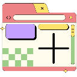

# Turbo Dash

A minimalist, brutalist-style new tab page that combines functionality with bold, stark design. This Chrome extension transforms your new tab experience with essential features wrapped in an aesthetically striking interface.

## Features

- Clean, brutalist design with bold typography and sharp shadows
- Real-time clock display
- Local weather information
- Todo list with persistent storage
- Google search integration
- Customizable quick links and icons
- Theme customization options
- Responsive layout that adapts to different screen sizes

## Installation

1. Visit the Chrome Web Store [link](https://chromewebstore.google.com/detail/turbo-dash/ojiejgejlecdfkkcemeobbogdfjclicj?hl=en-US&utm_source=ext_sidebar)
2. Click "Add to Chrome"
3. The extension will automatically activate on new tabs

## Usage

### Quick Links
- Add your favorite websites by clicking the "+" button
- Drag and drop to reorder links
- Right-click to edit or remove links

### Weather
- On first use, allow location access for local weather
- Click the weather widget to toggle between Celsius and Fahrenheit

### Todo List
- Add tasks using the input field
- Click tasks to mark them complete
- Right-click for additional options
- Tasks persist across sessions

### Customization
1. Click the settings icon in the top-right corner
2. Adjust theme colors and layout
3. Changes save when the "Save Changes" buttons is clicked

## Privacy

Turbo Dash respects your privacy:
- No data collection or tracking
- Weather data requires location permission (optional)
- All data stored locally on your device

## Support

Having issues? Email me at tom@turbologic.com
